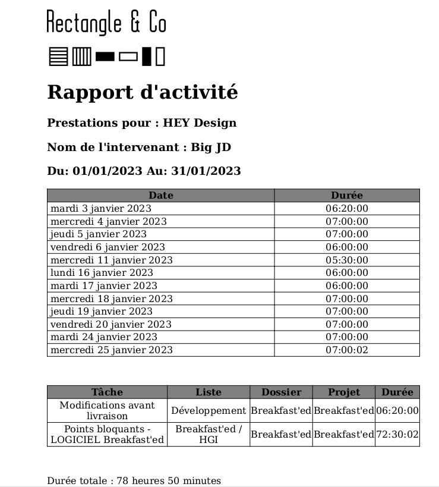

Quick and dirty CLI script to give an overview of one's worked hours on Click-Up by project between two dates.

Requests to the Click-Up REST V2 API are made for you using your Click-Up team_id and [Click-Up `pk_*` API key (called token here)](https://clickup.com/api/developer-portal/trytheapi/#step-1-enter-your-api-key).

This comes in handy for invoicing your customer.

Possible outputs are: JSON, HTML, PDF.

## Technological stack

This Python 3.x project leverages:
- [WeasyPrint](https://weasyprint.org/) for PDF rendering,
- the [Click-Up](https://clickup.com/) REST API to get time tracking info using your API token,
- [Jinja2](https://jinja.palletsprojects.com/en/3.1.x/) for HTML-templating,
- [Babel](https://babel.pocoo.org/en/latest/index.html)/[gettext](https://python.readthedocs.io/en/latest/library/gettext.html) for translation.

## Usage

The command works with a compulsory `--click-up-token` parameter and optional `--click-up-team-id` parameter, which you can provide as `CLICKUP_PK` and `CLICKUP_TEAM_ID` environment variables (or within a `.env` file, mimicking provided `.env.tpl`).

If the team ID (a digits value) is absent, it will be guessed from the user's teams as returned by the related Click-Up API endpoint. If that user has several teams, those are printed before exiting.

```
pip install -r requirements.txt
python click-up-timereport.py --click-up-token='pk_MY API KEY' [--click-up-team-id='MY_DIGITS_TEAMID']
```

See the `--help` or examples/quickstart sections below for more information.

```
python click-up-timereport.py --help
```

## Examples

See the `examples/` directory for sample JSON, HTML and PDF files using the template and company logo from the `templates/` directory.

- [Full command to generate](examples/command.md)
- [Example JSON report](examples/example1.json)
- [Example HTML report](examples/example1.html)
- [Example PDF report](examples/example1.pdf)

A little preview:



## Quickstart

1. Optionally add your Click-Up private key to `.env` (a copy of `.env.tpl`)
1. Below step creates and enables a virtual environment if you have none yet:

    ``python -m venv venv; . venv/bin/activate``

1. Install dependencies (at best in a Python virtual environment):

    ``pip install -r requirements.txt``

1. Run with optional date boundaries parameters and Click-Up token:

    ``python click-up-timereport.py # from now since 1 year ago``

    Output:
    ```
     Gathering Click-Up time entries from 2021-12-06 18:20:16 to 2022-12-06 18:20:16
     ...................................................................................................................................
     Daily time sheet:
     Tue, 01 Nov 2022 2h36m55
     Wed, 02 Nov 2022 2h13m0
     Thu, 03 Nov 2022 3h11m0

     Tasks summary:
     Task 1 Project B Listing C 2h36m55
     Task 2 Project C Listing C 5h24m0
     ....
     
     Total: 8h0m55
     ```

    ``python click-up-timereport.py --from_date=2022-11-01 # till now``

    ``python click-up-timereport.py --to_date=2022-12-30 # from 1 year before that date (default shift)``

    ``python click-up-timereport.py --from_date=2022-11-01 --to_date=2022-11-30 # with times from 00:00:00 to 23:59:59``

    ``python click-up-timereport.py --from_date=2022-11-01 --to_date=2022-11-30 --click_up_token=pk_SOMETHING --click_up_team_id=123DIGITSONLY45 # with Click-Up API token and team_id provided on CLI instead of .env``

## Input format
### JSON
The JSON file which the script outputs can be piped again to by command to prevent fetching Click-Up again:
```
python click-up-timereport.py --from-date=2023-01-01 --to-date=2023-01-31 --as-json --json-output-path=a.json
python click-up-timereport.py --from-date=2023-01-01 --to-date=2023-01-31 --from-json --json-input-path=a.json
```

### Template
The report's template can be fine-tuned in `templates/simple-report.html.j2`, using the Jinja2 syntax (similar to Twig in the PHP world).

## Output formats
Internally, the script creates a big Python dictionary, which it can dump as JSON, and/or feeds it to an HTML template to output both the HTML and PDF reports. So that JSON file is useful if you would like to template things your own way.

### JSON
Use `--as-json` and `--json-output-path=<full path to a json file>` together.

```
python click-up-timereport.py --from-date=2023-01-01 --to-date=2023-01-31 --as-json --json-output-path=a.json
```

### HTML
Use `--as-html` and `--html-output-path=<full path to an HTML file>` together.

```
python click-up-timereport.py --from-date=2023-01-01 --to-date=2023-01-31 --as-html --html-output-path=a.html
```

### PDF
Use `--as-pdf` and `--pdf-output-path=<full path to a PDF file>` together.

```
python click-up-timereport.py --from-date=2023-01-01 --to-date=2023-01-31 --as-pdf --pdf-output-path=a.pdf
```

## Locale / Language
For now english (default) and french are supported, with the `--language` option.

```
python click-up-timereport.py --from-date=2023-01-01 --to-date=2023-01-31 --as-pdf --pdf-output-path=a.pdf --language=french # or --language=english
```

## Enriching HTML & PDF outputs
The following fields are optional and apply for both HTML & PDF outputs.

### Document title
Add `--output-title="My time record title"` to custome the HTML page title or PDF document title.

#### Company logo
Add `--company-logo-img-path=<path to your non-SVG raster file>`, successfully tested with PNG. For rendering, the image is encoded to base64 first then injected into the template.

### Customer name
Add `--customer-name=<name of customer company or person>`.

### Consultant name
Add `--consultant-name=<name of consultant>`.

## i18n tips

Translations `.po` files in `locale/` were created by hand and compiled to `.mo` with the following command:
```
pybabel compile --domain=messages --directory=locale --use-fuzzy
```

## Running tests
You need to install `pytest` and `requests-mock` first using a test-oriented requirements file:
```
pip install -r test-requirements.txt
pip install -r requirements.txt
py.test tests.py
```

An `artifacts/` directory gets created in pytest's current working directory, for generating sample JSON/PDF/HTML files

To keep it, set the `KEEP_FILES_FOR_ARTIFACTS` environment variable to anything.

Head over to the [Actions tab](https://github.com/myselfhimself/click-up-timesheeting/actions) to understand how those tests work.


## License

Public domain.
